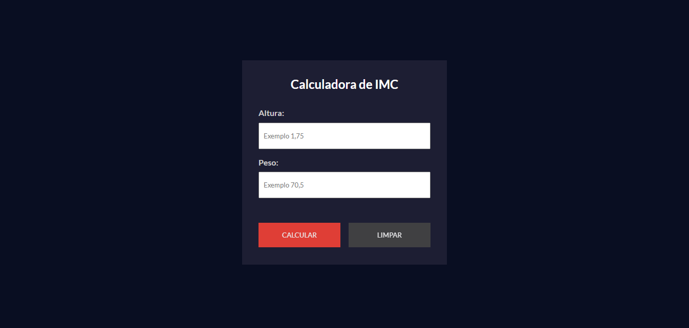

# Calculadora de IMC no React

O parâmetro adotado pela Organização Mundial de Saúde para calcular o peso ideal de cada pessoa é o IMC (índice de massa córporea). 

Cálculo do índice:  
IMC = peso / (altura x altura) 

O aplicativo desenvolvido em React oferece a funcionalidade de coletar os dados de peso e altura do usuário e pressionando o botão 'Calcular', é exibido uma tabela com o resultado do índice e situação atual conforme a tabela de classificação das faixas de IMC. 

 

### TECNOLOGIAS: 
HTML 
CSS 
REACT 
GIT/GITHUB

